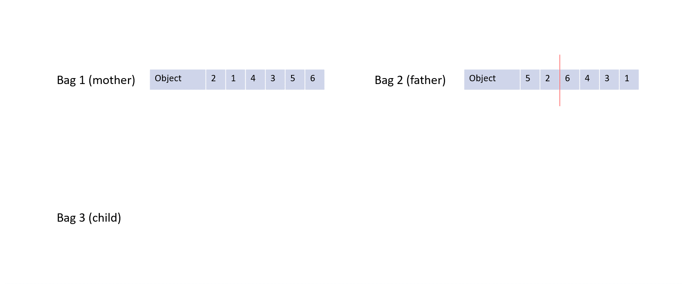

# Sac a dos
# Setup
Ce code est testé avec Python 3.10

Exigences: 
```
pip install typing_extensions matplotlib
```
# Le probleme
Une personne part en randonnée et emporte son sac à dos avec lui. Pour son voyage, il souhaite mettre quelques objets dans son sac à dos, mais il n'est pas assez solide pour tous les emballer, il doit donc limiter le poids.
Pour décider quels objets mettre dans son sac à dos, il a donné une valeur à chacun d'entre eux. Il essaie d'emporter la plus grande valeur sans dépasser la limite de poids.

# Les objets nécessaire
## Objet
- Un objet a une valeur et un poids. 
- Les objets sont invariables pendant tous les calculs pour le meilleur resultat.
## Sac à dos
- Le sac à dos contient des objets. 
- Il est possible de changer les objets dedans.
- Le sac à dos a un poids total qui est la somme de tous les objets qu'il contient.
- Le sac à dos a une valeur total qui est la somme de tous les objets qu'il contient.
- Le sac à une limite de poids qui est invariable.

# Approche de la solution
Le but de cette tâche est de maximiser la valeur du sac à dos en restant sous la limite du poids du sac à dos.

## Génétique
On résout ce problème avec un algrorithme de génétique.
Nous créons plusieurs sacs à dos qui contiennent des objets au hasard.

### Génome
Le génome contient l'information sur quels objets sont dans le sac a dos. Donc tous les sacs à dos ont un génome.

Il y a deux possibilités pour conserver cette information dans un génome.
1. Le génome contient tous les objets et l'ordre des objets est important pour déterminer quels objets sont dans le sac. (Tous les objets jusqu'à ce que le sac à dos soit trop lourd.)

2. Le génome contient l'information pour tous les objets si l'objet est dans le sac ou non. (Si le sac est trop lourd, il a une valeur de 0 (fitness))


La premiere approche est la moins bonne puisqu'il est impossible d'utiliser le principe de mère et père, seulement la Mytose. C'est parce que si on melange les objets des deux sacs à dos, on risque de dupliquer certains objets et d'en supprimer d'autres.

Ce problème n'existe pas dans la deuxième approche. Un gène représente l'absence ou la présence d'un objet. On modifie cette information en passant la valeur du gène de 0 à 1 ou de 1 à 0.

### Fonction d'évaluation
Encore une fois il y a plusieurs possibilités pour la réalisation de cette fonction:
1. Les valeurs des objets sont ajoutées et les poids sont supprimés
2. On utilise la relation entre valeur et poids pour rapidement trouver les objets les plus efficaces.
3. On somme les valeurs, mais si le sac est trop lourd, il a une valeur négative ou 0.

# Abstraction
Dans ce projet un peu d'abstraction était ajouté. Les classes "Population" et "Genome" peuvent être réutilisés. Sauf l'implementation de classe "Genome" doit être refait pour les nouvelles projets.