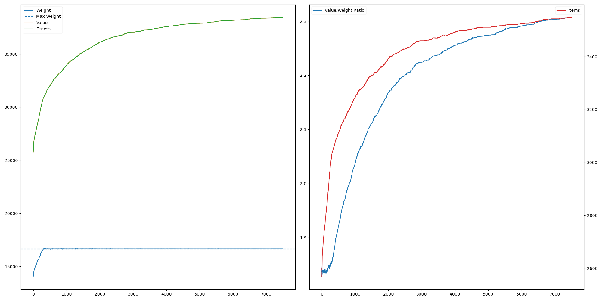

# Sac a dos
# Setup
Ce code est testé avec Python 3.10

Exigences: 
```
pip install typing_extensions matplotlib
```
# Le probleme
Une personne part en randonnée et emporte son sac à dos avec lui. Pour son voyage, il souhaite mettre quelques objets dans son sac à dos, mais il n'est pas assez solide pour tous les emballer, il doit donc limiter le poids.
Pour décider quels objets mettre dans son sac à dos, il a donné une valeur à chacun d'entre eux. Il essaie d'emporter la plus grande valeur sans dépasser la limite de poids.

# Les objets nécessaire

## Objet
- Un objet a une valeur et un poids. 
- Les objets sont invariables pendant tous les calculs pour le meilleur resultat.
## Sac à dos
- Le sac à dos contient des objets. 
- Il est possible de changer les objets dedans.
- Le sac à dos a un poids total qui est la somme de tous les objets qu'il contient.
- Le sac à dos a une valeur total qui est la somme de tous les objets qu'il contient.
- Le sac à une limite de poids qui est invariable.

# Approche de la solution
Le but de cette tâche est de maximiser la valeur du sac à dos en restant sous la limite du poids du sac à dos.

## Génétique
On résout ce problème avec un algrorithme de génétique.
Nous créons plusieurs sacs à dos qui contiennent des objets au hasard.

### Génome
Le génome contient l'information sur quels objets sont dans le sac a dos. Donc tous les sacs à dos ont un génome.

Il y a deux possibilités pour conserver cette information dans un génome.
1. Le génome contient tous les objets et l'ordre des objets est important pour déterminer quels objets sont dans le sac. (Tous les objets jusqu'à ce que le sac à dos soit trop lourd.)

2. Le génome contient l'information pour tous les objets si l'objet est dans le sac ou non. (Si le sac est trop lourd, il a une valeur de 0 (fitness))


La premiere approche est la moins bonne puisqu'il est impossible d'utiliser le principe de mère et père, seulement la Mytose. C'est parce que si on melange les objets des deux sacs à dos, on risque de dupliquer certains objets et d'en supprimer d'autres.

Ce problème n'existe pas dans la deuxième approche. Un gène représente l'absence ou la présence d'un objet. On modifie cette information en passant la valeur du gène de 0 à 1 ou de 1 à 0.

### Fonction d'évaluation
Encore une fois il y a plusieurs possibilités pour la réalisation de cette fonction:
1. Les valeurs des objets sont ajoutées et les poids sont supprimés
2. On somme les valeurs, mais si le sac est trop lourd, il a une valeur négative ou 0.
3. On somme les valeurs et ajoute la relation entre valeur et poids pour rapidement trouver les objets les plus efficaces.

### Mutations
Il y a deux types des mutations:
1. Sortir / Ajouter un objet dans le sac à dos
2. Echange un objet dans le sac à dos pour on autre.

La première mutation est obligatoire, sinon il n'est pas possible d'atteindre l'objectif. 
La deuxième mutation n'est pas indispensable, mais sans ce type de mutation, il est difficile d'améliorer le sac à dos lorsque le poids maximal est déjà atteint, car sur une période de deux mutations, il faut d'abord enlever un objet, puis en ajouter un meilleur. Mais comme un sac à dos avec un objet en moins est toujours moins bon qu'un sac plein, cet enchaînement de mutations se produit moins souvent.

# Abstraction
Dans ce projet un peu d'abstraction était ajouté. Les classes "Population" et "Genome" peuvent être réutilisés. Sauf l'implementation de classe "Genome" doit être refait pour les nouvelles projets.


# Resultats
Dans les diagrammes suivants, on peut voire la performance des algorithme pour les catégories differents.
1. Developpement du poid. (gauche)
2. Developpement de la valeur. (gauche)
3. Developpement de la relation entre valeur et poid. (droite)
4. Developpement de la quantité des objets. (droite)

La configuration était celle ci:
```
class Parametres:
    NB_OBJ = 5000           # Quantité des objects qui peuvent être ajouté au sac à dos
    OBJ_WEIGHT_MAX = 10     # Poid max d'objet
    OBJ_WEIGHT_MIN = 1      # Poid min d'objet
    OBJ_VALUE_MAX = 15      # Valeur max d'objet
    OBJ_VALUE_MIN = 5       # Valeur min d'objet
    BAG_WEIGHT_MAX = OBJ_WEIGHT_MAX * NB_OBJ / 3    # Poid max du sac à dos
    POPULATION_SIZE = 20
    MUTATION_PROP = .4      # Propabilité d'une mutation
    MAX_MUTATION_COUNT = 3  # Nombre maximal de mutations pouvant survenir en une seule fois
```

## Algorithme: Evaluation 1
L'algorithme est très bon pour détecter les objets ayant le meilleur rapport valeur/poids au début de l'algorithme. On ne peut guère constater de différence dans l'amélioration de la courbe avant et après avoir atteint le poids maximal. C'est pourquoi il n'ajoute pas les objets dans le sac à dos à la même vitesse que les autres algorithmes. Comme les objets ayant le meilleur rapport sont déjà dans le sac à dos, il a moins de mal à les trouver et à les remplacer lorsque le poids maximal est déjà atteint.

Mais il a un problème : il ne fonctionne pas dans tous les cas. Si, pour la plupart des objets, la valeur est inférieure au poids, le sac à dos n'est pas rempli, mais des objets sont retirés.

## Algorithme: Evaluation 2
Il s'agit de l'algorithme classique, le seul objectif étant de maximiser la valeur. Au début, la méthode la plus rapide pour y parvenir est d'ajouter des objets au sac à dos le plus rapidement possible. Plus tard, l'algorithme essaie de remplacer les objets par d'autres objets avec un ratio plus fort. La valeur dans cet algorithme correspond au fitness.

## Algorithme: Evaluation 3
Cet algorithme mélange les idées des deux autres. Dans l'évaluation, la valeur et le ratio contribuent au fitness. L'évolution du ratio et du poids du sac à dos se situe entre les deux autres.

## Meilleures résultats
Pour trouver les meilleurs résultats, l'algorithme a été exécuté sans limite d'itérations. S'il n'y avait pas de mutation au cours des 1000 dernières itérations, l'algorithme s'interrompt.
Algorithme | Eval1 | Eval2 | Eval3 |
--- | --- | --- | --- | 
Iterations | 26659 | 48707 | 32646 | 
Valeur | 40031 | 39822 | 39765 |
Poid | 16664 | 16666 | 16666 |
Nous pouvons voir que le premier algorithme d'évaluation est le plus fort avec ces parametres, atteignant un score plus élevé en moins de temps.